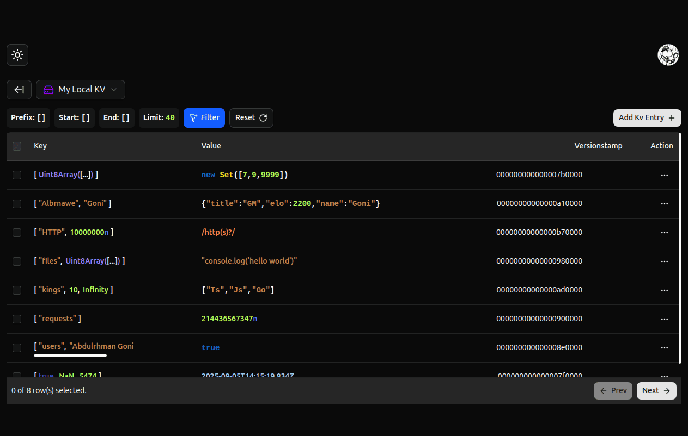

# Deno KV GUI Client

This is an open source desktop app client for [**Deno KV Database**](https://docs.deno.com/deploy/kv/manual/). <br/>
It enable you to browse your stored data inside Deno KV Databases and preform CRUD operations in a nice and modern GUI.

It's like **MongoDB Compass** for Mongo Database and **Redis Insight** for Redis Database.

<br />



## Download

To download the **Deno KV GUI Client** app, go to [releases](https://github.com/denokv-gui-client/releases) page, pick and download the file that matches your operating system:

- **Linux**
  - `.AppImage` (for all common Linux distributions)
  - `.deb` (Debian/Ubuntu installer)
- **Windows**
  - `.exe` (installer)
- **macOS**
  - `.dmg` (installer)

> [!IMPORTANT]
> If you are a linux user and downloaded the `.AppImage` file, you may need to make it executable before running it.
>
> You can make it executable like this: :point_down:
>
> ```bash
> chmod +x path/to/denokv-gui-client-x.x.x-linux-x86_64.AppImage
> # make sure to set the proper version
> ```

> [!NOTE] > **Note for Windows and Mac Users:**  
> This application is not code signed yet. When installing, you may encounter "Unknown Publisher" or similar security warnings.
> So please ensure you trust the source code before proceeding with the installation.

## Install and run localy

### Installation

1. clone the repo and entry project's directory

```bash
  git clone https://github.com/AbdulrhmanGoni/denokv-gui-client.git && cd denokv-gui-client
```

2. Install dependencies

```bash
  npm install
```

### Development Mode

To run the app in development mode:

```bash
  npm start
```

### Compiling The App

To compile or build the app use:

```bash
  npm run compile
```

> This command will create the build artifacts in `dist` directory

### Tests

To run the tests use:

```bash
  npm run test
```

> [!NOTE]
> To be able to run the tests, you should compile the app by running `npm run compile` first, Because the tests will be run on the compiled app inside `dist` directory.
